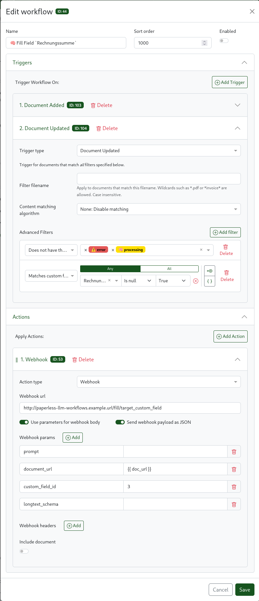

# Workflow Guide

This guide shows you how to set up webhook-triggered workflows in paperless-ngx to use each paperless-llm-workflows endpoint.

## Prerequisites

- paperless-ngx
- paperless-llm-workflows running and reachable from your paperless instance
- A paperless API token with document read/write permissions

## General Workflow Setup

In paperless-ngx, navigate to the **Workflows** it is located next to the mail and tags and custom field controls in the sidebar.



Every workflow follows the same pattern:
1. **Trigger**: Choose when the workflow fires (e.g., on document consumption/update)
   - **Conditions** Check for empty custom fields or specfic tag filters
2. **Action**: Add a "Call Webhook" action pointing to your paperless-llm-workflows instance
   - **URL**: `http://{llm-workflows-host}:8123/{endpoint}`
   - **Data**: JSON body with `document_url` and endpoint-specific parameters

### Automatic workflow configuration:

If the `webhook_public_url` parameter was specified paperless-llm-workflows is able to automaticall generate workflows for custom field filling for each supported custom 
field type. At service startup all currently configured custom fields are checked and corresponding workflows are created. Per default each workflows is disabled to make 
auto filling opt in per field.

### The `next_tag` Parameter

All endpoints accept an optional `next_tag` field. When set, the specified tag (by name or ID) is applied to the document after processing completes instead of the default `finished` tag. This enables chaining multiple workflow steps:

```json
{
  "document_url": "{{document_url}}",
  "next_tag": "needs-review"
}
```

After LLM processing, the document gets the `needs-review` tag, which can trigger a second workflow.

---

## Available Workflows

Here is a high level overview of the purpose of each workflow kind. For detailed api endpoint documentation including supported parameters review the 
api specification and the api guide.

### 1. Fill All Custom Fields

**Endpoint**: `POST /fill/custom_fields`

Auto-fills all empty custom fields on the document using LLM extraction.

**Use case**: New documents with custom fields (date, amount, invoice number, etc.) should be auto-filled during consumption.

---

### 2. Fill Specific Custom Field

**Endpoint**: `POST /fill/target_custom_field`

Fills a single custom field by ID. Supports custom prompts and JSON schema for longtext fields. If used in parallel with the fill all custom fields endpoint make
sure to provide ignore fields to the general filling pipeline so it does not interfere with the more targeted results.

**Use case**: You need to extract one specific field with customized instructions, or enforce a particular JSON format for large text fields.

---

### 3. Suggest Correspondent

**Endpoint**: `POST /suggest/correspondent`

Uses LLM reasoning to identify the correct correspondent from your existing correspondent list.

**Use case**: Documents from senders not yet recognized by paperless-ngx default matching. New corresponds in particular are not represented as much in the
data set until more document have been important. Thus paperless correspondent prediction needs time to adjust to new correspondents. Together with the decision
based tagging endpoint it is easy to build a workflow where first the correspondent is validated and if validation fails a new corresponend could be determined automatically.

---

### 4. Suggest Title

**Endpoint**: `POST /suggest/title`

Generates a document title. Supports Jinja-style templates for structured titles.

**Use case**: Auto-generate titles like "Acme Corp - 2025-01-15 - Invoice #1234" using a language model.

---

### 5. Decision-Based Tagging

**Endpoint**: `POST /decision`

Asks a yes/no question about the document and conditionally applies tags.

> At least one of `true_tag` or `false_tag` must be provided, or the request is rejected.

**Use case**: Route documents into different processing paths based on content. Combine with additional workflows that trigger on the assigned tags.

---

## Example: Multi-Step Workflow Chain

Here's a common pattern — fill fields, then check if it's an invoice, then title it:

1. **Workflow 1** — Trigger new document added:
   - Action: Webhook → `/decision`
   - Question: "Is { paperless_selected_correspondent} the correct sender of the document?"
   - `false_tag`: "suggest-corresponent"

2. **Workflow 2** — Trigger on tag "suggest-correspondent":
   - Action: Webhook → `/suggest/correspondent`

---

## Troubleshooting

- **"Document does not exist"** — The webhook can't find the document. Make sure `document_url` is passed correctly from paperless-ngx.
- **"Received request from unconfigured server"** — The `document_url` host doesn't match your configured `PAPERLESS_SERVER`. Check your configuration.
- **"Tag not found"** — The `true_tag`, `false_tag`, or `next_tag` references a tag that doesn't exist in paperless. Create it first or use an existing tag.
- Processing is slow — The LLM needs to load the model on first request. Subsequent requests are faster while the model stays loaded. The model unloads after the queue is idle.
